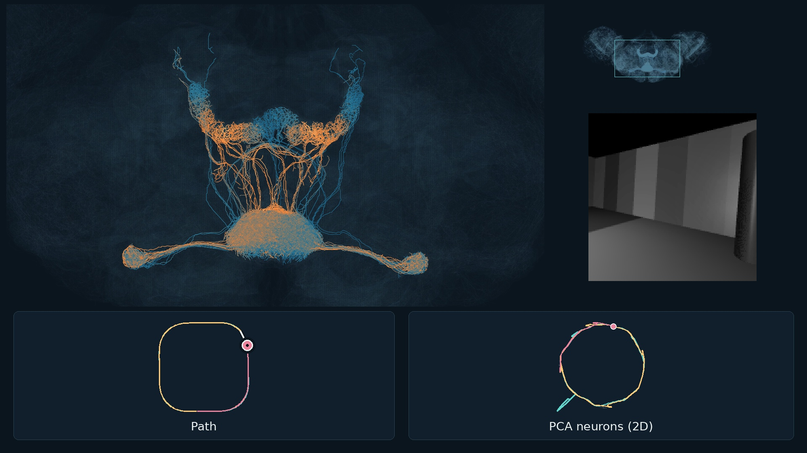

# Fly compass visualization

Recreate saved simulated compass activity on reconstructed fruit-fly neurons, alongside the camera, path and a 2D PCA projection of 46 compass neurons.



Requires Python 3.11 or newer.

```sh
git clone https://github.com/L99-hash/fly-compass-visualization.git
cd fly-compass-visualization
python3 -m venv .venv
source .venv/bin/activate
python -m pip install -r requirements.txt
python render.py
```

Video: `output/compass_activity.mp4`, ending with three laps × six headings. First run downloads about 175 MB of public anatomy.

PCA uses neural activity only. Its axes represent activity patterns, not physical position.

© 2026 Luca Crupi. Code: [MIT](https://opensource.org/license/mit). Recording, visuals and anatomy: [CC BY 4.0](https://creativecommons.org/licenses/by/4.0/).

Anatomy: [MaleCNS v1.0](https://male-cns.janelia.org/download/), FlyEM / HHMI Janelia, University of Cambridge, MRC LMB, Google Research and collaborators. Selected geometry is rescaled, projected, cropped, simplified and coloured with simulated activity.

Anatomical reference: [Berg et al. (2026)](https://doi.org/10.1016/j.cell.2026.08.015).

Biological inspiration: Seelig and Jayaraman (2015), [Neural dynamics for landmark orientation and angular path integration](https://doi.org/10.1038/nature14446).
